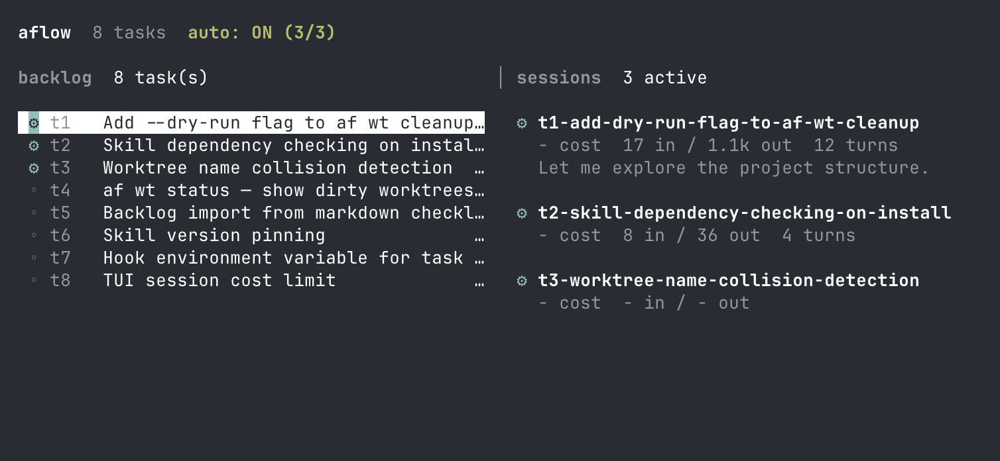

# aflow

Structured AI workflows for product and engineering. Two skill pipelines — one for turning ideas into specs, one for turning specs into code — powered by Claude Code.

## Getting Started

### Install

Requires [Bun](https://bun.sh) and the [GitHub CLI](https://cli.github.com).

```bash
curl -fsSL https://raw.githubusercontent.com/iceglober/aflow/main/install.sh | bash
```

### Initialize skills

Install aflow skills as Claude Code slash commands in your repo:

```bash
af skills
```

Or install globally (available in every repo):

```bash
af skills --user
```

This gives you two skill pipelines plus standalone research tools:

| Pipeline | Skills | Purpose |
|----------|--------|---------|
| **Spec** | `/spec-research-web` → `/spec-make` → `/spec-enrich` → `/spec-refine` → `/spec-review` → `/spec-lab` | Idea → research → spec → refined spec → validation |
| **Engineering** | `/think` → `/work` → `/fix` → `/qa` → `/ship` | Spec → code → ship |
| **Research** | `/research-auto` | Autonomous experimentation (think-test-reflect loop) |

## Spec Pipeline

Turn an idea into a tight, actionable product spec with tracked unknowns.

### `/spec-research-web` — Web Research

Decomposes a question into parallel agent workstreams. Each agent searches the web, writes findings to a markdown file, and a synthesis agent combines them.

```
/spec-research-web Build an E2E dental claim submission solution on top of our existing platform
```

Produces a `research/` directory with one file per agent plus a synthesis.

### `/spec-make` — Create Spec

Creates a structured product spec from research output **or** a direct feature description. Strips narrative, defines terms, surfaces unknowns as first-class tracked items, questions KPIs.

From research:
```
/spec-make research/dental-claims focused on submission only
```

From a description:
```
/spec-make A feature that lets users export their data as CSV with configurable column selection
```

Produces a spec file with:
- **Unknowns register** — numbered items (U-01, U-02...) with assumptions, risks, and what blocks on them
- **Requirements** — MUST/SHOULD/COULD with `[depends: U-xx]` tags
- **Business rules** — IF/THEN/ELSE decision logic
- **KPIs** — only what the spec's scope can actually influence

### `/spec-enrich` — Enrich from Codebase

Reads the spec's unknowns, searches the current repo to resolve what it can (schemas, types, configs, integrations), and produces an updated spec version. Fully autonomous — no user input.

```
/spec-enrich research/dental-claims/spec-submission.md
```

Resolves unknowns like "what does our encounter model look like?" by reading the actual schema. Cites every finding with `file:line` references. Anything it can't answer from code stays in the unknowns register for `/spec-refine`.

### `/spec-refine` — Refine with User

Interactive walkthrough of remaining unknowns. Asks one question at a time, in priority order (highest blast radius first). Integrates answers and produces a new versioned spec.

```
/spec-refine research/dental-claims/spec-submission-v2.md
```

Run this as many times as needed. Each pass produces a new version (`v3`, `v4`...) with fewer unknowns. "Skip" or "don't know" is always valid — the unknown stays in the spec.

### `/spec-review` — Gap Analysis

After multiple rounds of enrichment and refinement, audits the spec with fresh eyes. Reads the full version history, checks for consistency issues (orphaned dependency tags, stale assumptions, requirement conflicts), completeness gaps (unaddressed edge cases, missing business rules), and opportunities (existing capabilities that simplify requirements).

```
/spec-review research/dental-claims/spec-submission-v4.md
```

### `/spec-lab` — Validation Experiments

Designs and runs binary yes/no experiments to validate spec unknowns through code. Triages unknowns, runs experiments in parallel, and updates the spec with results.

```
/spec-lab research/dental-claims/spec-submission-v3.md
```

For open-ended optimization or iteration, use `/research-auto` instead.

### The Loop

```
/spec-research-web  →  /spec-make  →  /spec-enrich  →  /spec-refine × N  →  /spec-review
     (web)            (structure)      (codebase)        (human)              (audit)
                                                                                ↕
                                                                           /spec-lab
                                                                          (validation)
```

Each step reduces ambiguity. Research gathers raw information. Spec structures it and surfaces what's missing. Enrich answers what the code can answer. Refine gets human answers for the rest. Lab validates experimentable unknowns through code. Review audits the accumulated changes for gaps. Loop back to enrich/refine if review or lab surfaces new unknowns.

## Engineering Pipeline

Ship features with structured Claude Code skills. Adapted from [gstack](https://github.com/garrytan/gstack).

### `/think` — Plan Before Building

Product strategy session. Forces you to think through what you're building and why. Asks forcing questions (who wants this? what's the smallest version that matters?) and challenges the premise before any code is written.

### `/work` — Implement

Implements a task from a description. Pulls the latest default branch, creates a working branch, then works through the task methodically using existing codebase patterns.

```
/work Add CSV export with configurable column selection
```

### `/work-backlog` — Implement from Backlog

Works through the current task's unchecked items from `.aflow/backlog.json`. Reads the task matched by branch name, implements each item in dependency order, marks items done as it goes.

### `/fix` — Fix Issues

Fix bugs or implement changes within the current task scope. Classifies each issue (bug, scope change, new work) and updates the task's items if behavior changes.

### `/qa` — Quality Check

QA the current diff against the task's acceptance criteria. Builds a test matrix, walks through each scenario tracing the full code path, and produces a report with PASS/FAIL per criterion.

### `/ship` — Ship It

End-to-end shipping pipeline: typecheck → review → commit → push → PR. Verifies task items, creates a PR with a summary tied to the task, and updates the task status.

## Research

### `/research-auto` — Autonomous Experimentation

Based on [ResearcherSkill](https://github.com/krzysztofdudek/ResearcherSkill). An autonomous think-test-reflect loop for any domain where you can measure a result. The agent interviews you about the objective, sets up a `.lab/` directory for experiment tracking, then iterates freely — committing before each experiment, keeping what improves the metric, reverting what doesn't.

Includes guardrails (discard streaks trigger mandatory reflection/forking), branching strategy for exploring divergent approaches, and a multi-evaluator protocol for qualitative metrics.

```
/research-auto Optimize the p99 latency of the /api/encounters endpoint
```

## Worktrees

aflow makes git worktrees practical. Each feature gets its own directory with a shared `.git`.

```bash
af wt create feature-auth          # new branch + worktree, opens a shell
af wt create hotfix --from release  # fork from a specific branch
af wt checkout feature-payments     # worktree from an existing remote branch
af wt list                          # show all worktrees
af wt delete feature-auth           # clean up
af wt cleanup                       # batch-delete merged/stale worktrees
```

Set `AFLOW_DIR` to override where worktrees are stored.

## Task Dependencies

Tasks in `.aflow/backlog.json` support a `dependencies` field — an array of task IDs that must be completed (shipped/merged) before the task can start. The TUI shows blocked tasks and auto-start respects dependency ordering.

## Hooks

Run setup scripts automatically after creating a worktree:

```bash
af hooks   # creates .aflow/hooks/post_create template
```

The hook receives `WORKTREE_DIR`, `WORKTREE_NAME`, `BASE_BRANCH`, and `REPO_ROOT` as environment variables.

## Auto-Claude [Alpha]

`af start` launches an interactive TUI that runs the engineering pipeline above across a backlog of tasks with parallel Claude Code sessions.

Tasks live in `.aflow/backlog.json`. Add tasks, start them (creates a worktree + Claude session), and monitor multiple sessions running concurrently. Auto-start mode fills available concurrency slots with the highest-priority pending tasks whose dependencies are met.



## License

MIT
